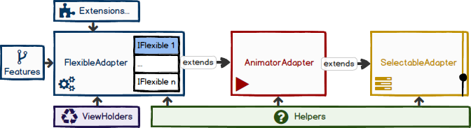

[](http://android-arsenal.com/details/1/2207)
[](https://bintray.com/davideas/maven/flexible-adapter/_latestVersion)
[](https://android-arsenal.com/api?level=14)
[](http://www.apache.org/licenses/LICENSE-2.0)
[](http://www.methodscount.com/?lib=eu.davidea%3Aflexible-adapter%3A5.0.0%2B)

# FlexibleAdapter

### ANNOUNCEMENT: Important changes in latest release
- **NEW!** Third release candidate: [v5.0.0-rc3](https://github.com/davideas/FlexibleAdapter/releases/tag/5.0.0-rc3) built on 2017.10.20
- If you come from previous versions, update your code following the Wiki page [Migrations](https://github.com/davideas/FlexibleAdapter/wiki/Migrations).
- Please read [issues](https://github.com/davideas/FlexibleAdapter/issues) and [releases](https://github.com/davideas/FlexibleAdapter/releases).

### One Adapter many Apps
> :mega: When initially Android team introduced the RecyclerView widget, we had to implement a custom Adapter in several applications, again and again to provide the items for our views.<br/>
We didn't know how to add selection and to combine all the use cases in the same Adapter.
Since I created this library, it has become easy to configure multiple views and now, nobody wants to use a ListView anymore.

The idea behind is to regroup multiple features in a unique library, without the need to customize and import several third libraries not compatible among them.

The FlexibleAdapter helps developers to simplify this process without worrying too much about the Adapter anymore. It's easy to use, it has predefined logic for different situations and prevents common mistakes.<br/>
This library is configurable and it guides the developers to create a better user experience and now, even more with the new features.

### Main features
* Simple, Single & Multi selection mode with [ActionModeHelper](https://github.com/davideas/FlexibleAdapter/wiki/5.x-%7C-ActionModeHelper).
* Auto mapping multi view types with [Item interfaces](https://github.com/davideas/FlexibleAdapter/wiki/5.x-%7C-Item-Interfaces).
* Predefined [ViewHolders](https://github.com/davideas/FlexibleAdapter/wiki/5.x-%7C-ViewHolders) with click listeners and others callbacks.
* Customizable [FastScroller](https://github.com/davideas/FlexibleAdapter/wiki/5.x-%7C-FastScroller) with new features.
* Customizable [Scrolling Animations](https://github.com/davideas/FlexibleAdapter/wiki/5.x-%7C-Adapter-Animations) based on adapter position and beyond.
* Customizable [Animations](https://github.com/davideas/FlexibleAdapter/wiki/5.x-%7C-Adapter-Animations#item-animations-when-items-are-notified) when adding and removing items.
* [Advanced item decoration](https://github.com/davideas/FlexibleAdapter/wiki/5.x-%7C-Flexible-Item-Decoration) (customizable dividers, sections gap and item offsets).
* Restore deleted items with [UndoHelper](https://github.com/davideas/FlexibleAdapter/wiki/5.x-%7C-UndoHelper); Works with Expandable items too!
* Async [Filter](https://github.com/davideas/FlexibleAdapter/wiki/5.x-%7C-Search-Filter) with Spannable text; Result list is animated; With optional original list; Works with sub items too!
* [High performance](https://github.com/davideas/FlexibleAdapter/wiki/5.x-%7C-Search-Filter#performance-result-when-animations-are-active) updates and filter on big list (far better than _DiffUtil_).
* [Headers and Sections](https://github.com/davideas/FlexibleAdapter/wiki/5.x-%7C-Headers-and-Sections) with sticky behaviour fully clickable and collapsible, elevation, transparency and automatic linkage!
* [Scrollable Headers and Footers](https://github.com/davideas/FlexibleAdapter/wiki/5.x-%7C-Scrollable-Headers-and-Footers) items that lay respectively at the top and at the bottom of the main items.
* Easy runtime position calculation for adding/moving items in sections.
* [Expandable items](https://github.com/davideas/FlexibleAdapter/wiki/5.x-%7C-Expandable-items) with _Selection Coherence_ and multi-level expansion.
* [Drag&Drop and Swipe-To-Dismiss](https://github.com/davideas/FlexibleAdapter/wiki/5.x-%7C-Drag&Drop-and-Swipe#swiping-the-front-view) with Leave-Behind pattern and with _Selection Coherence_.
* Innovative bottom and top [EndlessScroll](https://github.com/davideas/FlexibleAdapter/wiki/5.x-%7C-On-Load-More) (_No OnScrollListener_).
* Supports [thirds LayoutManagers](https://github.com/davideas/FlexibleAdapter/wiki/5.x-%7C-Thirds-Layout-Managers).
* [DrawableUtils](https://github.com/davideas/FlexibleAdapter/wiki/5.x-%7C-Utils) for dynamic backgrounds with ripple effect (_No XML_).
* **NEW!** Custom Tags for multiple Adapter instances.
* Comprehensive [Wiki](https://github.com/davideas/FlexibleAdapter/wiki) pages and JavaDoc documentation.

### Extensions
* **NEW!** [Live Data](https://github.com/davideas/FlexibleAdapter/wiki/Extensions-%7C-LiveData).
* Data Binding.

# Setup
#### build.gradle
```
repositories {
	jcenter()
	maven {url = "https://oss.sonatype.org/content/repositories/snapshots/" } //For Snapshots
}
```
```
dependencies {
	// Using JCenter
	compile 'eu.davidea:flexible-adapter:5.0.0-rc3'
	compile 'eu.davidea:flexible-adapter-livedata:1.0.0-b1'
	compile 'eu.davidea:flexible-adapter-databinding:1.0.0-b2'
	
	// Using MavenSnapshots repository for continuous updates from my development
	compile 'eu.davidea:flexible-adapter:5.0.0-SNAPSHOT'
}
```
#### Stay Updated
|Flexible Adapter|Live Data|Data Binding|More extensions|
|---|---|---|---|
|<div align="center">5.0.0-rc3</div>|<div align="center">1.0.0-b1</div>|<div align="center">1.0.0-b2</div>|<div align="center">Coming soon</div>
|<a href='https://bintray.com/davideas/maven/flexible-adapter?source=watch' alt='Get automatic notifications about new "flexible-adapter" versions'></a>|<a href='https://bintray.com/davideas/maven/flexible-adapter-livedata?source=watch' alt='Get automatic notifications about new "flexible-adapter-livedata" versions'></a>|<a href='https://bintray.com/davideas/maven/flexible-adapter-databinding?source=watch' alt='Get automatic notifications about new "flexible-adapter-databinding" versions'></a>||

# Wiki!
I strongly recommend to read the **new [Wiki](https://github.com/davideas/FlexibleAdapter/wiki) pages**, where you can find a comprehensive Tutorial.<br/>
Wiki pages have been completely reviewed to support all the coming features of version 5.0.0.

### Pull requests / Issues / Improvement requests
Feel free to contribute and ask!<br/>
Active discussions:
- [The next steps of development: Final Release > Extensions](https://github.com/davideas/FlexibleAdapter/issues/361).
- [Snapshots and Pre-Releases for FlexibleAdapter v5.0.0](https://github.com/davideas/FlexibleAdapter/issues/39).

### Under the hood
Some simple features have been implemented, thanks to some Blogs (see at the bottom of the page), merged and methods have been improved for speed and scalability.

<p align="center"></p>

* At lower level there is `SelectableAdapter` class. It provides selection features and it's able to _maintain the state_ after the rotation: you just need to call the onSave/onRestore methods from the Activity!
* At middle level, the `AnimatorAdapter` class has been added to give some animation at startup and when user scrolls.
* At front level, the core class `FlexibleAdapter`. It holds and handles the main list, performs actions on all different types of item paying attention at the adding and removal of the items, as well as the new concept of "selection coherence".
* New useful extensions and helpers have been added during the time to simplify the development.
* Item interfaces and predefined ViewHolders complete the whole library giving more actions to the items and configuration options to developers.

# Showcase of the demo App
You can [download](https://github.com/davideas/FlexibleAdapter/releases)* the latest demo App from the latest release page OR run it with the emulator.<br>
This [Wiki page](https://github.com/davideas/FlexibleAdapter/wiki/5.x-%7C-Demo-App) will give you a short briefing of the demo App.

\* = Publishing to Play Store is foreseen for final release.


# Change Log
###### Latest release
[v5.0.0-rc3](https://github.com/davideas/FlexibleAdapter/releases/tag/5.0.0-rc3) - 2017.10.20

###### Old releases
[v5.0.0-rc2](https://github.com/davideas/FlexibleAdapter/releases/tag/5.0.0-rc2) - 2017.06.10 |
[v5.0.0-rc1](https://github.com/davideas/FlexibleAdapter/releases/tag/5.0.0-rc1) - 2017.01.14<br/>
[v5.0.0-b8](https://github.com/davideas/FlexibleAdapter/releases/tag/5.0.0-b8) - 2016.09.17 |
[v5.0.0-b7](https://github.com/davideas/FlexibleAdapter/releases/tag/5.0.0-b7) - 2016.06.20 |
[v5.0.0-b6](https://github.com/davideas/FlexibleAdapter/releases/tag/5.0.0-b6) - 2016.05.01 |
[v5.0.0-b5](https://github.com/davideas/FlexibleAdapter/releases/tag/5.0.0-b5) - 2016.04.04<br/>
[v5.0.0-b4](https://github.com/davideas/FlexibleAdapter/releases/tag/5.0.0-b4) - 2016.02.21 |
[v5.0.0-b3](https://github.com/davideas/FlexibleAdapter/releases/tag/5.0.0-b3) - 2016.02.08 |
[v5.0.0-b2](https://github.com/davideas/FlexibleAdapter/releases/tag/5.0.0-b2) - 2016.01.31 |
[v5.0.0-b1](https://github.com/davideas/FlexibleAdapter/releases/tag/5.0.0-b1) - 2016.01.03<br/>
[v4.2.0](https://github.com/davideas/FlexibleAdapter/releases/tag/4.2.0) - 2015.12.12 |
[v4.1.0](https://github.com/davideas/FlexibleAdapter/releases/tag/4.1.0) - 2015.11.29 |
[v4.0.1](https://github.com/davideas/FlexibleAdapter/releases/tag/4.0.1) - 2015.11.01 |
[v4.0.0](https://github.com/davideas/FlexibleAdapter/releases/tag/4.0.0) - 2015.10.18<br/>
[v3.1](https://github.com/davideas/FlexibleAdapter/releases/tag/v3.1) - 2015.08.18 |
[v3.0](https://github.com/davideas/FlexibleAdapter/releases/tag/v3.0) - 2015.07.29 |
[v2.2](https://github.com/davideas/FlexibleAdapter/releases/tag/v2.2) - 2015.07.20 |
[v2.1](https://github.com/davideas/FlexibleAdapter/releases/tag/v2.1) - 2015.07.03 |
[v2.0](https://github.com/davideas/FlexibleAdapter/releases/tag/v2.0) - 2015.06.19 |
[v1.0](https://github.com/davideas/FlexibleAdapter/releases/tag/v1.0) - 2015.05.03

# Limitations
Item half swipe cannot be implemented due to how the `android.support.v7.widget.helper.ItemTouchHelper` is done, also clicks on rear view are not possible, same reason.
Half swipe can be done with others means, please see issues #98 and #100. See also commits of Apr 25, 2016. 

# Thanks
###### Inspired by
- http://enoent.fr/blog/2015/01/18/recyclerview-basics/
- https://www.grokkingandroid.com/statelistdrawables-for-recyclerview-selection/

###### Special thanks goes to
- Martin Guillon ([Akylas](https://github.com/Akylas)) to have contributed at the development of the new technique for the Sticky Header.
- [Arpinca](https://github.com/arpinca) who added new features for FastScroller like _autoHide_ and _ignoreTouchesOutsideHandle_ and more.

###### Donations
This library is currently free to use and modify, if you would like to say _Thank You_ by donating any amount, you're very welcome! Here the link to PayPal.me:

[](https://www.paypal.me/davideas)

# Imported libraries
- The library [LollipopContactsRecyclerViewFastScroller](https://github.com/AndroidDeveloperLB/LollipopContactsRecyclerViewFastScroller) has been imported, improved and adapted to work in conjunction with `AnimatorAdapter`.
- The library [sticky-headers-recyclerview](https://github.com/timehop/sticky-headers-recyclerview) was initially imported, then it was removed in favor of the new technique able to manage a real _View_ and so to handle the click events.
- The item spacing technique comes from the library [CommonItemDecoration](https://github.com/ibosong/CommonItemDecoration), and it has been improved with new features.

# Apps that use this Adapter
It will be a pleasure to add your App here, once it is published.

[Module.org](https://play.google.com/store/apps/details?id=org.module.app) |
[Neuronizer](https://play.google.com/store/apps/details?id=de.djuelg.neuronizer) |
[Socio - Shake and Connect!](https://play.google.com/store/apps/details?id=com.atsocio.socio) |
[Shibagram](https://play.google.com/store/apps/details?id=com.apripachkin.shibagram) |
[BNVR Client](https://play.google.com/store/apps/details?id=ru.beward.bnvr)

# License

#### FlexibleAdapter & Extensions

    Copyright 2015-2017 Davide Steduto

    Licensed under the Apache License, Version 2.0 (the "License");
    you may not use this file except in compliance with the License.
    You may obtain a copy of the License at

       http://www.apache.org/licenses/LICENSE-2.0

    Unless required by applicable law or agreed to in writing, software
    distributed under the License is distributed on an "AS IS" BASIS,
    WITHOUT WARRANTIES OR CONDITIONS OF ANY KIND, either express or implied.
    See the License for the specific language governing permissions and
    limitations under the License.

#### FastScroller

    Copyright 2016-2017 AndroidDeveloperLB, Davide Steduto & Arpinca

    Licensed under the Apache License, Version 2.0 (the "License");
    you may not use this file except in compliance with the License.
    You may obtain a copy of the License at

    http://www.apache.org/licenses/LICENSE-2.0

    Unless required by applicable law or agreed to in writing, software
    distributed under the License is distributed on an "AS IS" BASIS,
    WITHOUT WARRANTIES OR CONDITIONS OF ANY KIND, either express or implied.
    See the License for the specific language governing permissions and
    limitations under the License.
